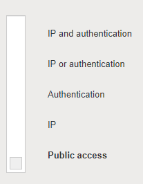
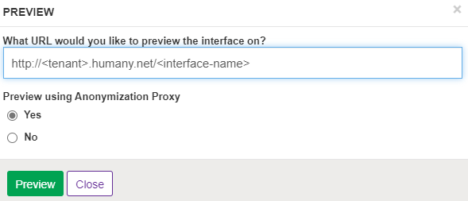
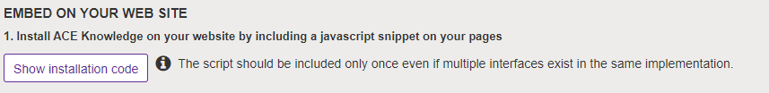
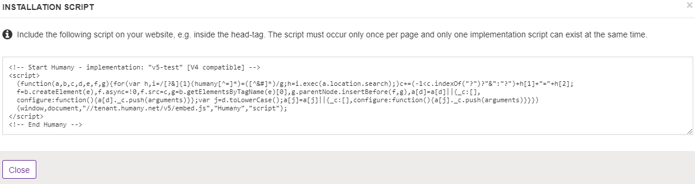

## Anonymization Proxy

Anonymization Proxy is a tool that detects and anonymizes Personally Identifiable Information (PII) originating from the use of ACE Knowledge Widgets. This tool is designed to help protect user privacy when interacting with ACE Knowledge Widgets. Any detected PII is processed within Telia cloud and never reaches foreign entities such as Microsoft Azure, where ACE Knowledge backend is hosted.

## Features

Anonymization Proxy offers the following features:
  * Anonymization of PII such as personal names, social security numbers, and telephone numbers.
  * Client IP masking - IP addresses are automatically masked as they are only visible to Anonymization Proxy application. Anonymization Proxy does not store this information and does not forward it to ACE Knowledge backend.

## Using Anonymization Proxy

Before using Anonymization Proxy, please note the following:
  * Anonymization Proxy currently only works with public Widgets.
  * Anonymization Proxy does not allow searching on PII in Widgets.
  * Anonymization Proxy cannot be used for v1-v3 Widget implementations.
  * Widgets distributed through Web provisions cannot be configured to use Anonymization Proxy.

### Enabling Anonymization Proxy

Please contact ACE Knowledge support team to start using Anonymization Proxy. They will enable the feature for your specified tenant(s).

#### Portals

For Portal type of Widgets hosted on ACE Knowledge that are publicly accessible, no additional configuration is needed. Simply ensure that the access mode is set to `Public access` in Widget's Security Settings:

Then open the Portal Widget by clicking `Preview` and choosing `Yes` to `Preview using Anonymization Proxy` option:

### Widgets Embedded on Your website

To embed Widget on your website and configure it to use Anonymization Proxy, follow the general Widget installation instructions in `Embed on your website` section of Widget Editor. One small modification is needed for the installation script.

1. Click on `Show installation code`:

2. A dialog showing the installation code similar to below will pop up:

3. Copy the installation code and replace `humany.net` domain in the link of the last line of the script tag to `anon-proxy.ace.teliacompany.net`.

For example, if the link is `//tenant.humany.net/v5/embed.js`, after the change it should become `//tenant.anon-proxy.ace.teliacompany.net/v5/embed.js`.
  
4. Follow the rest of the steps as they are defined in `Embed on your website` section.

For more information about Anonymization Proxy, contact the ACE Knowledge support team.